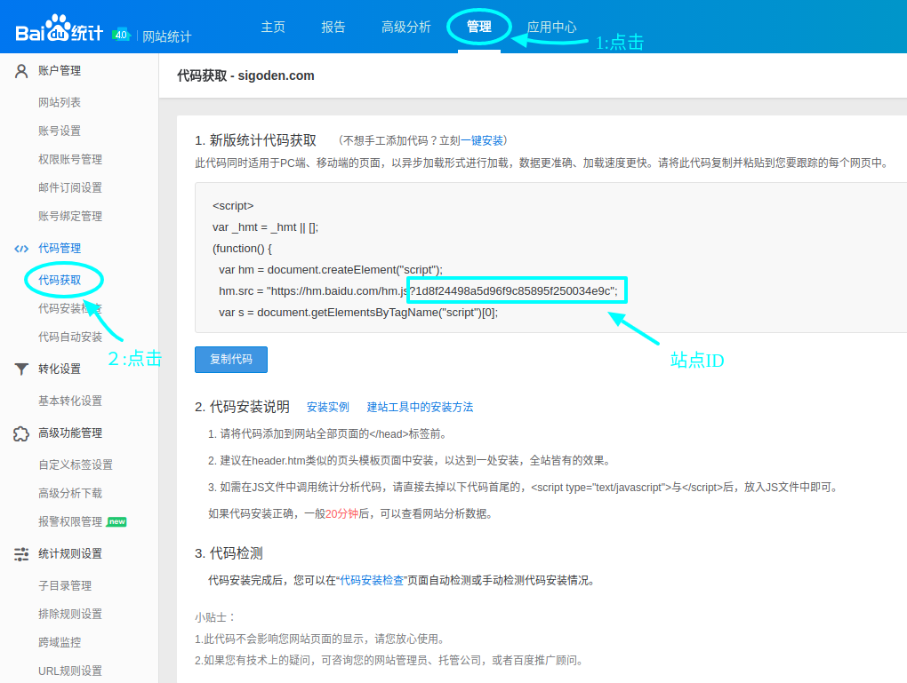

# gatsby-plugin-baidu-tongji

添加百度统计到 Gatsby 站点。

## 安装

`npm install --save gatsby-plugin-baidu-tongji`

## 使用方法

```javascript
// ./gatsby-config.js
plugins: [
  {
    resolve: `gatsby-plugin-baidu-tongji`,
    options: {
			// 百度统计站点ID
      siteid: "YOUR_BAIDU_TONGJI_SITE_ID",
      // 配置统计脚本插入位置，默认值为 false, 表示插入到 body 中, 为 true 时插入脚本到 head 中
      head: false,
    },
  },
];
```

## 获取 siteid

浏览器进入 https://tongji.baidu.com/, 依次点击: 管理（导航栏）-> 代码获取（侧边栏），进入如下页面



上图代码中 hm.baidu.com/h.js%3F 后面的32个16进制数，就是该站点的站点id
